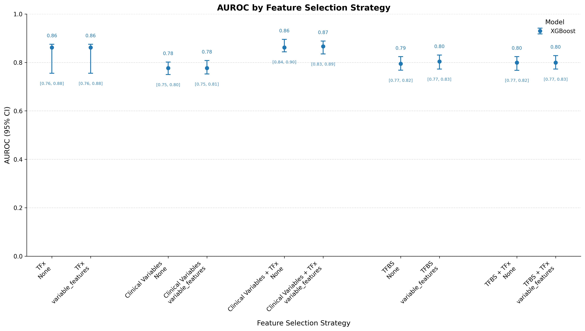

# Prognostic Model for Treatment Treatment Response

An XGBoost machine learning algorithm built to determine treatment response in mCRPC ultra-low pass whole genome sequencing (ULP-WGS) data.

<br></br>

## Overview
An XGBoost machine learning algorithm built to determine treatment response in metastatic castration-resistant prostate cancer (mCRPC) using ultra-low pass whole genome sequencing (ULP-WGS) data.

## Requirements & Installation

**Environment:** Fred Hutchinson Cancer Center `rhino` cluster (LMOD module system required) - has not been tested on other systems

```bash
# Load required modules
ml Python/3.8.2-GCCcore-9.3.0
ml matplotlib
```

**Clone the repository:**
```bash
git clone https://github.com/WestonHanson/Prognostic-XGBoost-Model-for-Predicting-Treatment-Response.git
cd Prognostic-XGBoost-Model-for-Predicting-Treatment-Response
```

> **Note:** This pipeline was developed and validated on the Fred Hutchinson `rhino` HPC cluster. Running it in a different environment will require adapting the module loading steps above to your local Python setup.


## Usage

```bash
python main_feature_selection_updated.py
```

The script will interactively prompt you at startup:

| Prompt response | Behavior |
|-----------------|----------|
| `yes` (no existing model) | Trains and saves a new model |
| `yes` (existing model found) | Asks whether to overwrite or run on a validation set |
| `no` | Exits the program |

## Mutable Variables
All variables below are set in the `USER INPUT` section at the top of `main.py`.

**File paths:**

| Variable | Description |
|----------|-------------|
| `pluvicto_master_sheet_file` | Absolute path to a CSV containing all patient metadata (sample ID, treatment cycles, PSA, TFx, etc.). This is the largest clinical data file and the one most likely to need column updates as the study evolves. |
| `tfbs_data_file` | Absolute path to a TSV of TFBS activation scores. Expected columns: `patient_id`, `time_point`, `progression_cycle`, `tumor_fraction`, `genomic_instability`, `progression_group`, `tumor_group`, followed by TFBS site columns. |
| `FGA_data_file` | Absolute path to a TSV of fraction genome altered data. Expected columns: `patient_id`, `time_point`, `progression_cycle`, `tumor_fraction`, `genomic_instability`. |
| `clinical_data_file` | Absolute path to a CSV of clinical baseline data. Expected columns: `Sample_ID`, plus any additional clinical variables. |
| `proteus_gsva_data_file` | Absolute path to a TXT file produced by [Proteus](https://github.com/GavinHaLab) (developed by Dennie Patton, Gavin Ha Lab). Contains computed hallmark expression scores × patient ID. |
| `entropy_data_file` | Absolute path to a CSV of chromosome-level Shannon entropy scores computed from Process 2 of the [Entropy Repo](https://github.com/WestonHanson/Copy-Number-Analysis-via-Chromosome-Shannon-Entropy). Expected columns: `patient_id`, `cycle`, followed by per-chromosome columns. |

> These files could technically be consolidated into one, but are kept separate to allow flexible column selection and to accommodate different file layouts across data sources.

> **Important:** The `Standardized data processing` section of `main.py` will likely need to be updated to match your column names. Make sure the **first column of every input dataframe is the sample ID** — this is the index used to merge all dataframes.

**Model versioning:**

| Variable | Description | Example |
|----------|-------------|---------|
| `model_ver` | Major model version. Increment when making a new model. | `"v0.0.0"`, `"v1.0.0"` |
| `model_subver` | Minor model subversion. Increment for smaller iterations. | `"v0.0.1"`, `"v0.1.3"` |


## Inputs
All inputs can be changed in main.py under the *USER IMPUT* section. <p>
Each permutation in the inputs dictionary has this format:
```
"permuntation key": {
    "responder_group": "",
    "feature_selection_methods": [null],
    "tfx_cutoff": 0.00,
    "cycle_filter": "",
    "pluvicto_master_sheet_cols": null,
    "tfbs_data_cols": null,
    "FGA_data_cols": null,
    "clinical_data_cols": null,
    "proteus_gsva_data_cols": null,
    "entropy_data_cols": null,
    "subset_for_top_features": false,
    "predictor_subset_num": null,
    "top_feature_num": null
}
```
**Parameter descriptions:**
| input | description | options |
| ----- | ----------- | ------- | 
| responder_group | The column the model will use as its responder vs non-responder categories | Any of the columns created from `add_responder_groupings()` in `/scripts/data_processing-functions.py`
| feature_selection_methods | A list of feature selection methods each split will use to shrink the feature space. | Any of the if statements from `feature_selection_helper()` in `/scripts/data_processing-functions.py` and/ or "null" 
| tfx_cutoff | A floating point variable used as the floor for tumor fraction | 0.00 ≤ *x* ≤ 100.00
| cycle_filter | A string from `pluvicto_master_sheet_file` cycle column to filter down samples to one time point | Any one of the unique strings in `pluvicto_master_sheet_file` cycle column
| pluvicto_master_sheet_cols | List of columns to inlcude from `pluvicto_master_sheet_file` | "null" (no columns), [] (all columns), or ["example_col_1", "example_col_2", "example_col_3"]
| tfbs_data_cols | List of columns to inlcude from `tfbs_data_file` | "null" (no columns), [] (all columns), or ["example_col_1", "example_col_2", "example_col_3"]
| FGA_data_cols | List of columns to inlcude from `FGA_data_file` | "null" (no columns), [] (all columns), or ["example_col_1", "example_col_2", "example_col_3"]
| clinical_data_cols | List of columns to inlcude from `clinical_data_file` | "null" (no columns), [] (all columns), or ["example_col_1", "example_col_2", "example_col_3"]
| proteus_gsva_data_cols | List of columns to inlcude from `proteus_gsva_data_file` | "null" (no columns), [] (all columns), or ["example_col_1", "example_col_2", "example_col_3"]
| entropy_data_cols | List of columns to inlcude from `entropy_data_file` | "null" (no columns), [] (all columns), or ["example_col_1", "example_col_2", "example_col_3"]
| subset_for_top_features | Depreciated set to "false"
| predictor_subset_num | Depreciated set to "false"
| top_feature_num | Depreciated set to "false"

## Outputs
- **`/saved-models/`** — serialized trained model (versioned by `model_ver` / `model_subver`)
- **`all_features_auc_95_CI_plot.png`** — AUROC plot with 95% confidence intervals across all permutations and feature selection methods (see [Example](#example) below)

## Model Details
| Property | Value |
|----------|-------|
| **Algorithm** | XGBoost (gradient boosting) |
| **Task** | Binary logistic classification (responder vs. non-responder) |
| **Cross-validation** | Stratified k-fold (default k=3) |
| **Train/validation split** | 75% training / 25% holdout |
| **Bootstrapping** | 100 iterations per feature selection method on different random seeds, used to build a 95% CI around the median validation AUROC |

**Hyperparameter tuning** is performed with [Optuna](https://optuna.org/) over the following search ranges:
```
param_ranges = {
    'eta': (0.01, 0.05),
    'max_depth': (2, 5),
    'min_child_weight': (1, 3),
    'max_delta_step': (0, 1),
    'subsample': (0.6, 0.9),
    'colsample_bytree': (0.3, 0.7),
    'colsample_bylevel': (0.3, 0.8),
    'colsample_bynode': (0.3, 0.8),
    'gamma': (0, 0.5),
    'lambda': (1, 5),
    'alpha': (0.5, 2)
}
```
- Other parameters can be found in the `PRE-LOOP PROCESSING` section of the main file

## Example
The following `input.json` runs five permutations, each comparing two feature selection methods (`null` and `"variable_features"`):
```
{
    "TFx": {
        "responder_group": "progression_group_survival_days_252_cutoff",
        "feature_selection_methods": [null, "variable_features"],
        "tfx_cutoff": 0.03,
        "cycle_filter": "C1",
        "pluvicto_master_sheet_cols": ["progression_group_survival_days_252_cutoff", "TFx_C1"],
        "tfbs_data_cols": null,
        "FGA_data_cols": null,
        "clinical_data_cols": null,
        "proteus_gsva_data_cols": null,
        "entropy_data_cols": null,
        "subset_for_top_features": false,
        "predictor_subset_num": null,
        "top_feature_num": null
    },
    "Clinical Variables": {
        "responder_group": "progression_group_survival_days_252_cutoff",
        "feature_selection_methods": [null, "variable_features"],
        "tfx_cutoff": 0.03,
        "cycle_filter": "C1",
        "pluvicto_master_sheet_cols": ["progression_group_survival_days_252_cutoff"],
        "tfbs_data_cols": null,
        "FGA_data_cols": null,
        "clinical_data_cols": [],
        "proteus_gsva_data_cols": null,
        "entropy_data_cols": null,
        "subset_for_top_features": false,
        "predictor_subset_num": null,
        "top_feature_num": null
    },
    "Clinical Variables + TFx": {
        "responder_group": "progression_group_survival_days_252_cutoff",
        "feature_selection_methods": [null, "variable_features"],
        "tfx_cutoff": 0.03,
        "cycle_filter": "C1",
        "pluvicto_master_sheet_cols": ["progression_group_survival_days_252_cutoff", "TFx_C1"],
        "tfbs_data_cols": null,
        "FGA_data_cols": null,
        "clinical_data_cols": [],
        "proteus_gsva_data_cols": null,
        "entropy_data_cols": null,
        "subset_for_top_features": false,
        "predictor_subset_num": null,
        "top_feature_num": null
    },
    "TFBS": {
        "responder_group": "progression_group_survival_days_252_cutoff",
        "feature_selection_methods": [null, "variable_features"],
        "tfx_cutoff": 0.03,
        "cycle_filter": "C1",
        "pluvicto_master_sheet_cols": ["progression_group_survival_days_252_cutoff"],
        "tfbs_data_cols": ["AFF1", "AFF4", "AGO1", "AHR", "AR", "ARID1A", "ARID2", "ARID4B", "ARNT", "ARNTL", "ASCL1", "ASCL2", "ATF1", "ATF2", "ATF3", "ATF4", "ATF7", "BATF", "BATF3", "BCL11A", "BCL3", "BCL6", "BHLHE40", "BICRA", "BMI1", "BRCA1", "BRD2", "BRD3", "BRD4", "BRD7", "BRD9", "BRPF3", "CBFA2T3", "CBX3", "CDK2", "CDK7", "CDK8", "CDK9", "CDKN1B", "CDX2", "CEBPA", "CEBPB", "CEBPD", "CEBPG", "CENPA", "CHD1", "CHD2", "CHD7", "CHD8", "CLOCK", "CNOT3", "CREB1", "CREBBP", "CREM", "CRY1", "CTBP1", "CTBP2", "CTCF", "CTCFL", "CUL4A", "DAXX", "DDIT3", "DNMT3B", "DPF2", "DTL", "DUX4", "E2F1", "E2F4", "E2F6", "E2F7", "E2F8", "EBF1", "EBF3", "EED", "EGR1", "EGR2", "EGR3", "EHF", "EHMT2", "ELF1", "ELF3", "ELL2", "EMSY", "EOMES", "EP300", "EP400", "EPAS1", "ERCC6", "ERG", "ESR1", "ESR2", "ESRRA", "ETS1", "ETV1", "ETV2", "ETV5", "ETV6", "EZH2", "FANCD2", "FEZF1", "FLI1", "FOS", "FOSL1", "FOSL2", "FOXA1", "FOXA2", "FOXA3", "FOXH1", "FOXM1", "FOXO1", "FOXP1", "GABPA", "GATA1", "GATA2", "GATA3", "GATA4", "GATA6", "GATAD2A", "GATAD2B", "GFI1", "GLIS1", "GLIS3", "GRHL2", "GRHL3", "GTF2F1", "H2AFZ", "HAND2", "HDAC1", "HDAC2", "HES2", "HEXIM1", "HEY1", "HIC1", "HIF1A", "HIRA", "HMG20A", "HMGXB4", "HNF1A", "HNF1B", "HNF4A", "HNF4G", "HNRNPK", "HNRNPL", "HNRNPLL", "HOMEZ", "HOXA9", "HOXB13", "HOXC5", "HSF1", "IKZF1", "IKZF2", "INTS11", "INTS13", "IRF1", "IRF2", "IRF4", "ISL1", "JARID2", "JMJD6", "JUN", "JUNB", "JUND", "KDM1A", "KDM2B", "KDM4A", "KDM5B", "KDM6A", "KLF1", "KLF11", "KLF15", "KLF16", "KLF4", "KLF5", "KLF6", "KLF9", "KMT2A", "KMT2B", "KMT2C", "LARP7", "LEO1", "LMNA", "LMNB1", "LMO1", "LYL1", "MAF", "MAFF", "MAFG", "MAFK", "MAX", "MAZ", "MBD4", "MBL2", "MCM7", "ME1", "ME3", "MECOM", "MED12", "MEF2A", "MEF2B", "MEIS1", "MEIS2", "MIER3", "MITF", "MIXL1", "MLLT1", "MNT", "MSC", "MTA2", "MTOR", "MYB", "MYC", "MYCN", "MYOD1", "NANOG", "NCOA1", "NCOA3", "NCOR1", "NCOR2", "NELFA", "NELFE", "NEUROD1", "NEUROG2", "NFATC1", "NFE2", "NFE2L2", "NFIA", "NFIC", "NFIL3", "NFKB1", "NFKB2", "NFYA", "NIPBL", "NKX2-1", "NKX3-1", "NONO", "NOTCH1", "NR1H3", "NR2C2", "NR2F1", "NR2F2", "NR2F6", "NR3C1", "NR4A1", "NRF1", "OGG1", "ONECUT2", "ORC2", "OSR2", "OTX2", "PADI2", "PARP1", "PAX3", "PAX5", "PBX1", "PBX2", "PBX3", "PBX4", "PCF11", "PDX1", "PEX2", "PGR", "PHF8", "PHOX2B", "PIAS1", "PKNOX1", "POU2F1", "POU2F2", "POU5F1", "PPARG", "PRDM1", "PRDM10", "PRDM6", "PRDM9", "PRMT1", "PROX1", "RAD21", "RAG2", "RARA", "RB1", "RBAK", "RBBP5", "RBFOX2", "RBM25", "RBPJ", "RCOR1", "RELA", "RELB", "REST", "RFX1", "RING1", "RNF2", "RUNX1", "RUNX1T1", "RUNX2", "RXRA", "RXRB", "SAP130", "SAP30", "SCRT1", "SETDB1", "SFPQ", "SIN3A", "SIRT1", "SIX2", "SKI", "SMAD1", "SMAD2", "SMAD3", "SMAD4", "SMARCA4", "SMARCC1", "SMC1A", "SMC3", "SNAI2", "SOX13", "SOX2", "SOX5", "SP1", "SP140", "SP2", "SP4", "SP5", "SPI1", "SPIB", "SRC", "SREBF2", "SRF", "SS18", "SSRP1", "SSU72", "STAG1", "STAG2", "STAT1", "STAT3", "STAT5A", "STAT5B", "SUMO2", "SUPT5H", "SUZ12", "T", "TAF1", "TAL1", "TBL1XR1", "TBP", "TBX2", "TBX21", "TBX5", "TCF12", "TCF3", "TCF4", "TCF7L1", "TCF7L2", "TEAD1", "TEAD4", "TET2", "TFAP2A", "TFAP2C", "TFAP4", "THAP11", "TLE3", "TOP1", "TP53", "TP53BP1", "TP63", "TP73", "TRIM22", "TRIM24", "TRIM28", "TRPS1", "TWIST1", "UBTF", "USF1", "USF2", "USP7", "VDR", "WT1", "XBP1", "XRCC5", "YY1", "ZBTB17", "ZBTB2", "ZBTB26", "ZBTB33", "ZBTB40", "ZBTB42", "ZBTB48", "ZBTB7A", "ZEB1", "ZFP36", "ZFP64", "ZFX", "ZHX2", "ZIM3", "ZKSCAN1", "ZMYM3", "ZNF121", "ZNF143", "ZNF146", "ZNF24", "ZNF263", "ZNF316", "ZNF317", "ZNF341", "ZNF35", "ZNF366", "ZNF384", "ZNF467", "ZNF554", "ZNF639", "ZNF644", "ZNF770", "ZNF92", "ZSCAN16", "p65"],
        "FGA_data_cols": null,
        "clinical_data_cols": null,
        "proteus_gsva_data_cols": null,
        "entropy_data_cols": null,
        "subset_for_top_features": false,
        "predictor_subset_num": null,
        "top_feature_num": null
    },
    "TFBS + TFx": {
        "responder_group": "progression_group_survival_days_252_cutoff",
        "feature_selection_methods": [null, "variable_features"],
        "tfx_cutoff": 0.03,
        "cycle_filter": "C1",
        "pluvicto_master_sheet_cols": ["progression_group_survival_days_252_cutoff", "TFx_C1"],
        "tfbs_data_cols": ["AFF1", "AFF4", "AGO1", "AHR", "AR", "ARID1A", "ARID2", "ARID4B", "ARNT", "ARNTL", "ASCL1", "ASCL2", "ATF1", "ATF2", "ATF3", "ATF4", "ATF7", "BATF", "BATF3", "BCL11A", "BCL3", "BCL6", "BHLHE40", "BICRA", "BMI1", "BRCA1", "BRD2", "BRD3", "BRD4", "BRD7", "BRD9", "BRPF3", "CBFA2T3", "CBX3", "CDK2", "CDK7", "CDK8", "CDK9", "CDKN1B", "CDX2", "CEBPA", "CEBPB", "CEBPD", "CEBPG", "CENPA", "CHD1", "CHD2", "CHD7", "CHD8", "CLOCK", "CNOT3", "CREB1", "CREBBP", "CREM", "CRY1", "CTBP1", "CTBP2", "CTCF", "CTCFL", "CUL4A", "DAXX", "DDIT3", "DNMT3B", "DPF2", "DTL", "DUX4", "E2F1", "E2F4", "E2F6", "E2F7", "E2F8", "EBF1", "EBF3", "EED", "EGR1", "EGR2", "EGR3", "EHF", "EHMT2", "ELF1", "ELF3", "ELL2", "EMSY", "EOMES", "EP300", "EP400", "EPAS1", "ERCC6", "ERG", "ESR1", "ESR2", "ESRRA", "ETS1", "ETV1", "ETV2", "ETV5", "ETV6", "EZH2", "FANCD2", "FEZF1", "FLI1", "FOS", "FOSL1", "FOSL2", "FOXA1", "FOXA2", "FOXA3", "FOXH1", "FOXM1", "FOXO1", "FOXP1", "GABPA", "GATA1", "GATA2", "GATA3", "GATA4", "GATA6", "GATAD2A", "GATAD2B", "GFI1", "GLIS1", "GLIS3", "GRHL2", "GRHL3", "GTF2F1", "H2AFZ", "HAND2", "HDAC1", "HDAC2", "HES2", "HEXIM1", "HEY1", "HIC1", "HIF1A", "HIRA", "HMG20A", "HMGXB4", "HNF1A", "HNF1B", "HNF4A", "HNF4G", "HNRNPK", "HNRNPL", "HNRNPLL", "HOMEZ", "HOXA9", "HOXB13", "HOXC5", "HSF1", "IKZF1", "IKZF2", "INTS11", "INTS13", "IRF1", "IRF2", "IRF4", "ISL1", "JARID2", "JMJD6", "JUN", "JUNB", "JUND", "KDM1A", "KDM2B", "KDM4A", "KDM5B", "KDM6A", "KLF1", "KLF11", "KLF15", "KLF16", "KLF4", "KLF5", "KLF6", "KLF9", "KMT2A", "KMT2B", "KMT2C", "LARP7", "LEO1", "LMNA", "LMNB1", "LMO1", "LYL1", "MAF", "MAFF", "MAFG", "MAFK", "MAX", "MAZ", "MBD4", "MBL2", "MCM7", "ME1", "ME3", "MECOM", "MED12", "MEF2A", "MEF2B", "MEIS1", "MEIS2", "MIER3", "MITF", "MIXL1", "MLLT1", "MNT", "MSC", "MTA2", "MTOR", "MYB", "MYC", "MYCN", "MYOD1", "NANOG", "NCOA1", "NCOA3", "NCOR1", "NCOR2", "NELFA", "NELFE", "NEUROD1", "NEUROG2", "NFATC1", "NFE2", "NFE2L2", "NFIA", "NFIC", "NFIL3", "NFKB1", "NFKB2", "NFYA", "NIPBL", "NKX2-1", "NKX3-1", "NONO", "NOTCH1", "NR1H3", "NR2C2", "NR2F1", "NR2F2", "NR2F6", "NR3C1", "NR4A1", "NRF1", "OGG1", "ONECUT2", "ORC2", "OSR2", "OTX2", "PADI2", "PARP1", "PAX3", "PAX5", "PBX1", "PBX2", "PBX3", "PBX4", "PCF11", "PDX1", "PEX2", "PGR", "PHF8", "PHOX2B", "PIAS1", "PKNOX1", "POU2F1", "POU2F2", "POU5F1", "PPARG", "PRDM1", "PRDM10", "PRDM6", "PRDM9", "PRMT1", "PROX1", "RAD21", "RAG2", "RARA", "RB1", "RBAK", "RBBP5", "RBFOX2", "RBM25", "RBPJ", "RCOR1", "RELA", "RELB", "REST", "RFX1", "RING1", "RNF2", "RUNX1", "RUNX1T1", "RUNX2", "RXRA", "RXRB", "SAP130", "SAP30", "SCRT1", "SETDB1", "SFPQ", "SIN3A", "SIRT1", "SIX2", "SKI", "SMAD1", "SMAD2", "SMAD3", "SMAD4", "SMARCA4", "SMARCC1", "SMC1A", "SMC3", "SNAI2", "SOX13", "SOX2", "SOX5", "SP1", "SP140", "SP2", "SP4", "SP5", "SPI1", "SPIB", "SRC", "SREBF2", "SRF", "SS18", "SSRP1", "SSU72", "STAG1", "STAG2", "STAT1", "STAT3", "STAT5A", "STAT5B", "SUMO2", "SUPT5H", "SUZ12", "T", "TAF1", "TAL1", "TBL1XR1", "TBP", "TBX2", "TBX21", "TBX5", "TCF12", "TCF3", "TCF4", "TCF7L1", "TCF7L2", "TEAD1", "TEAD4", "TET2", "TFAP2A", "TFAP2C", "TFAP4", "THAP11", "TLE3", "TOP1", "TP53", "TP53BP1", "TP63", "TP73", "TRIM22", "TRIM24", "TRIM28", "TRPS1", "TWIST1", "UBTF", "USF1", "USF2", "USP7", "VDR", "WT1", "XBP1", "XRCC5", "YY1", "ZBTB17", "ZBTB2", "ZBTB26", "ZBTB33", "ZBTB40", "ZBTB42", "ZBTB48", "ZBTB7A", "ZEB1", "ZFP36", "ZFP64", "ZFX", "ZHX2", "ZIM3", "ZKSCAN1", "ZMYM3", "ZNF121", "ZNF143", "ZNF146", "ZNF24", "ZNF263", "ZNF316", "ZNF317", "ZNF341", "ZNF35", "ZNF366", "ZNF384", "ZNF467", "ZNF554", "ZNF639", "ZNF644", "ZNF770", "ZNF92", "ZSCAN16", "p65"],
        "FGA_data_cols": null,
        "clinical_data_cols": null,
        "proteus_gsva_data_cols": null,
        "entropy_data_cols": null,
        "subset_for_top_features": false,
        "predictor_subset_num": null,
        "top_feature_num": null
    }
}
```
**Output plot:**
<p>

<p>
**Interpreting the plot:** Each dictionary key (`"TFx"`, `"Clinical Variables"`, etc.) appears as a group of x-axis ticks. Within each group, ticks represent key + `feature_selection_methods` pairs. Each line shows the median validation AUROC with a shaded 95% confidence interval across 100 bootstrap iterations.

## Acknowlegements
This pipeline was developed by Weston Hanson in the Gavin Ha Lab, Fred Hutchinson Cancer Center, under the supervision of Robbert D. Patton and Patrick McDeed.

## License
Copyright 2025 Fred Hutchinson Cancer Center

Permission is hereby granted, free of charge, to any government or not-for-profit entity, or to any person employed at one of the foregoing (each, an "Academic Licensee") who obtains a copy of this software and associated documentation files (the ÒSoftwareÓ), to deal in the Software purely for non-commercial research and educational purposes, including the rights to use, copy, modify, merge, publish, distribute, sublicense, and/or share copies of the Software, and to permit other Academic Licensees to whom the Software is furnished to do so, subject to the following conditions:
The above copyright notice and this permission notice shall be included in all copies or substantial portions of the Software.Ê
No Academic Licensee shall be permitted to sell or use the Software or derivatives thereof in any service for commercial benefit. For the avoidance of doubt, any use by or transfer to a commercial entity shall be considered a commercial use and will require a separate license with Fred Hutchinson Cancer Center.

THE SOFTWARE IS PROVIDED ÒAS ISÓ, WITHOUT WARRANTY OF ANY KIND, EXPRESS OR IMPLIED, INCLUDING BUT NOT LIMITED TO THE WARRANTIES OF MERCHANTABILITY, FITNESS FOR A PARTICULAR PURPOSE AND NONINFRINGEMENT. IN NO EVENT SHALL THE AUTHORS OR COPYRIGHT HOLDERS BE LIABLE FOR ANY CLAIM, DAMAGES OR OTHER LIABILITY, WHETHER IN AN ACTION OF CONTRACT, TORT OR OTHERWISE, ARISING FROM, OUT OF OR IN CONNECTION WITH THE SOFTWARE OR THE USE OR OTHER DEALINGS IN THE SOFTWARE.
